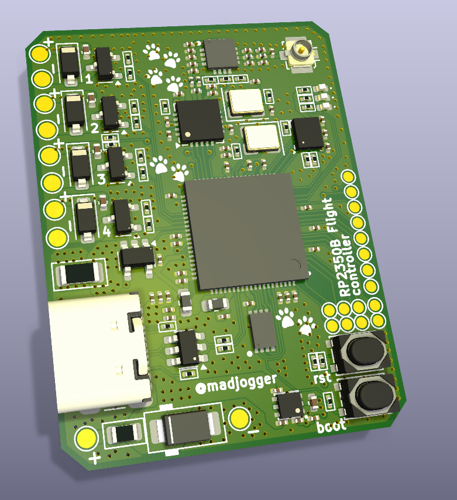
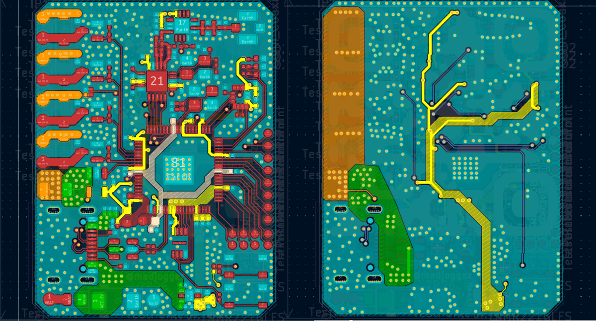

# RP2350B-Flight-controller  

> Ultra-compact flight controller for mini quadcopters, based on **RP2350B** MCU.  
> Board size: **30.5 × 39.8 mm**, yet includes IMU, radio module, motor drivers, and full USB power support.  
 
  

---

## Key Features  
- **MCU:** RP2350B (dual-core, PIO, USB device)  
- **IMU:** LSM6DS3 (accelerometer + gyroscope, SPI connection)  
- **Radio module:** NRF24L01 + RFX2401C PA/LNA amplifier  
- **Motors:** 4× brushed DC motors (up to 5 A per channel, short peak)  
- **USB-powered flight possible** (low-current motors, enough supply over USB)  
- **Additional expansion pins** (GPIO3–16 + SWD) for sensors, debugging, or add-ons  

---

## Pin Mapping  

### IMU (LSM6DS3) — SPI2  
| RP2350B GPIO | Signal | Notes |
|--------------|--------|-------|
| GPIO19 | SPI2_MISO | Sensor data out |
| GPIO22 | SPI2_MOSI | Sensor data in |
| GPIO23 | SPI2_SCK  | SPI clock |
| GPIO20 | IMU_INT1  | Interrupt 1 |
| GPIO21 | IMU_INT2  | Interrupt 2 |

---

### Radio Module (NRF24L01 + RFX2401C)  
| RP2350B GPIO | Signal | Notes |
|--------------|--------|-------|
| GPIO28 | SPI_MOSI | Shared SPI bus |
| GPIO36 | SPI_MISO | Shared SPI bus |
| GPIO37 | SPI_SCK  | Shared SPI bus |
| GPIO30 | NRF_CS   | Chip select |
| GPIO31 | NRF_CE   | Enable |
| GPIO32 | NRF_IRQ  | Interrupt |

---

### Motors  
| RP2350B GPIO | Output | Notes |
|--------------|--------|-------|
| GPIO45 | Motor_1 | Brushed motor driver |
| GPIO46 | Motor_2 | Brushed motor driver |
| GPIO47 | Motor_3 | Brushed motor driver |
| GPIO48 | Motor_4 | Brushed motor driver |
| GPIO49 | Motor_current | Current sense |
| GPIO52 | Motor_voltage | Battery/rail voltage sense |

---

### LEDs  
| RP2350B GPIO | Signal | Notes |
|--------------|--------|-------|
| GPIO17 | LED1 | Status LED |
| GPIO18 | LED2 | Status LED |

---

### Debug / Expansion  
- **SWD interface** exposed for programming/debugging  
- **GPIO3–16** free for custom extensions (I²C, UART, SPI, PWM, ADC etc.)  

---

## Power  
- Powered from **USB** or external battery  
- USB can sustain hover/low-thrust operation with small coreless motors  
- Onboard regulation for MCU, IMU, radio, and motor supply  

---

## Use Case  
- Designed for **tiny brushed quadcopters** and robotics experiments  
- Combines **motion sensing, wireless control, and motor drivers** in one small board  
- Fits into custom drone frames without extra breakout boards  

---

## Quick Start  
1. Connect via **USB-C** for firmware flashing and testing.  
2. Flash firmware (e.g. custom flight stack on RP2350B).  
3. Connect brushed motors to outputs GPIO45–48.  
4. Pair radio link via NRF24L01 (with RFX2401C amp).  
5. Power from USB for tests, or from LiPo for flight.  

---

## Notes  
- Motor channels rated for **5 A peak per motor** (coreless brushed).  
- Ensure airflow for heat dissipation at higher loads.  
- Expansion pins allow integration of GPS, barometer, or additional sensors.  

---
